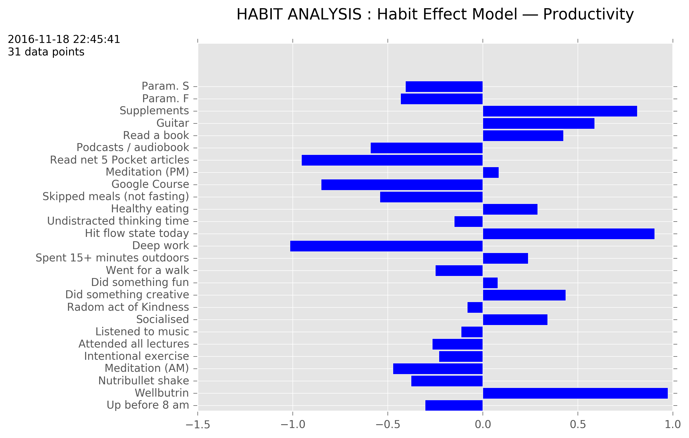

# QS-Analyser
A quantified self data analysis script in Python 3. 
Compares 31 days of data points with my subjective ranking of productivity (out of 5)and uses 
matrix functions to create an approximate model of which daily habits help and hinder my working productivity.

  

